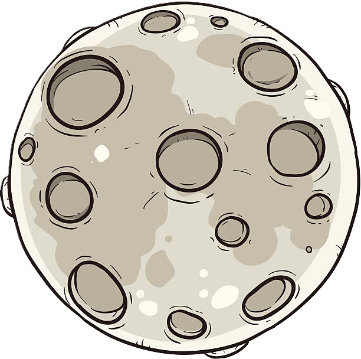

<div align="center">

# GasLight GPT

[](https://opensource.org/licenses/MIT)
[](https://www.python.org/)
[](https://fastapi.tiangolo.com/)
[](https://github.com/yourusername/gaslight_chatgpt)

<p align="center">
  
</p>

**Modern Conversational AI with Retro-Futuristic Design**

[Overview](#overview) • 
[Features](#features) • 
[Installation](#installation) • 
[Usage](#usage) • 
[Documentation](#file-descriptions) • 
[Contributing](#contributing)

</div>

---

## Overview

GasLight GPT combines professional AI capabilities with an elegant retro-futuristic interface. The application delivers sophisticated conversational intelligence through an engaging and distinctive user experience, suitable for both professional and entertainment purposes.

<details>
<summary>Interface Preview</summary>
<p align="center">
  
</p>
</details>

## Features

| Feature | Description |
|---------|-------------|
| **Intuitive Interface** | Clean design with thoughtful retro-inspired elements |
| **Space Theme** | Professional visuals with subtle cosmic elements |
| **Advanced AI** | Context-aware conversations with natural language processing |
| **Real-time Updates** | Efficient response system with minimal latency |
| **User Authentication** | Secure access and session management |
| **Responsive Design** | Full compatibility across all devices and screen sizes |

## Project Structure

```
/C:/2025/gaslight_chatgpt/
├── static/                  # Static assets
│   ├── css/                 # Styling resources
│   ├── js/                  # Client-side scripts
│   └── images/              # Visual elements
├── templates/               # HTML templates
├── server.py                # FastAPI implementation
├── app.py                   # Alternative Flask implementation
├── requirements.txt         # Dependencies
└── README.md                # Documentation
```

## Installation

### Prerequisites

- Python 3.8+
- pip package manager
- Internet connection

### Setup Steps

1. Clone the repository:
   ```sh
   git clone https://github.com/yourusername/gaslight_chatgpt.git
   ```

2. Navigate to the project directory:
   ```sh
   cd gaslight_chatgpt
   ```

3. Install dependencies:
   ```sh
   pip install -r requirements.txt
   ```

## Usage

### Server Configuration

**Standard Development:**
```sh
uvicorn app:app --reload
```

**Production Deployment:**
```sh
uvicorn server:app --reload --port 8000 --host 0.0.0.0
```

**Alternative Method:**
```sh
python app.py
```

### Access Points

- Default Uvicorn: `http://localhost:8000`
- Default Flask: `http://localhost:5000`
- Network Access: `http://your-server-ip:8000`

### User Guide

1. Enter your query in the interface
2. Submit your message
3. Review the AI's response
4. Continue the conversation
5. Use the logout function when finished

## File Descriptions

| File | Purpose |
|------|---------|
| `server.py` | Core backend functionality and API routes |
| `app.py` | Alternative implementation for development |
| `main.html` | Primary user interface template |
| `main.css` | Visual styling and responsive design |
| `main.js` | Frontend interactivity and API communication |
| `requirements.txt` | Project dependencies |

## API Endpoints

| Endpoint | Method | Function |
|----------|--------|----------|
| `/chat` | POST | Process user messages and return responses |
| `/history` | GET | Retrieve conversation history |
| `/logout` | POST | End user session |

## Contributing

We welcome contributions to enhance GasLight GPT:

1. Fork the repository
2. Create a feature branch (`git checkout -b feature-name`)
3. Implement your changes
4. Commit with clear messages
5. Push to your branch and submit a pull request

Please review our contribution guidelines for detailed information.

## License

This project is licensed under the MIT License - see the [LICENSE](LICENSE) file for details.

---

<div align="center">

**Powered by advanced language models • Designed for modern professionals**

<p>
  
  <br>
  <sub>© 2025 GasLight GPT - Voyage through the digital cosmos</sub>
</p>

</div>
